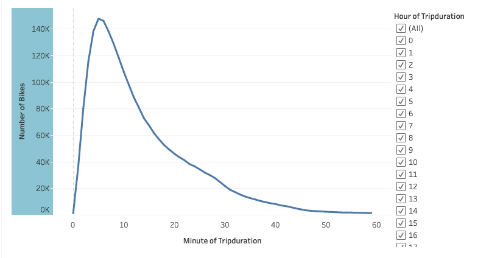
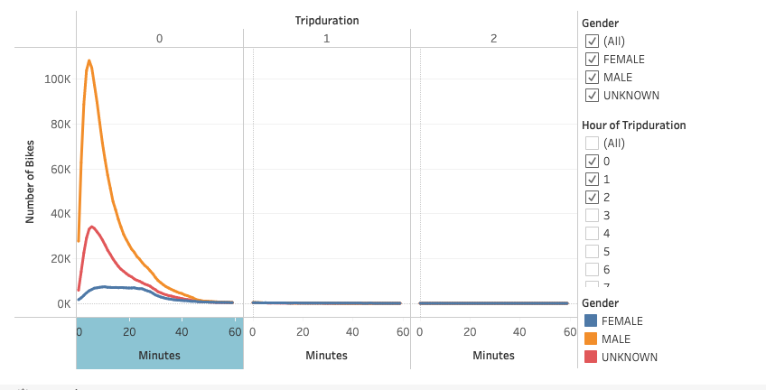
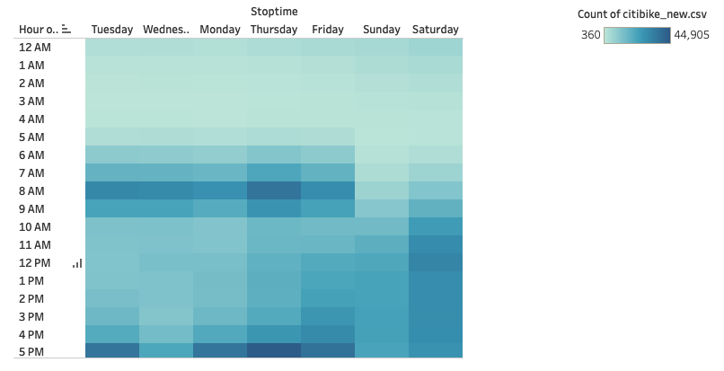
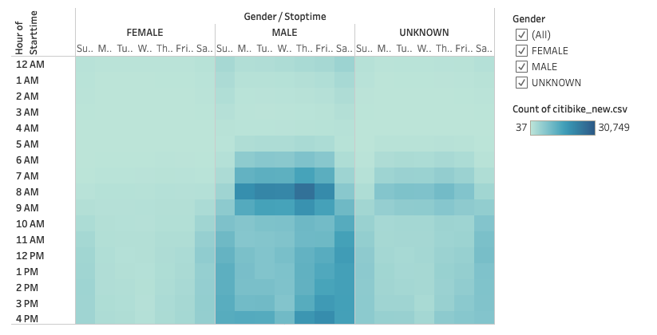
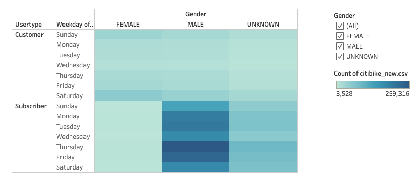
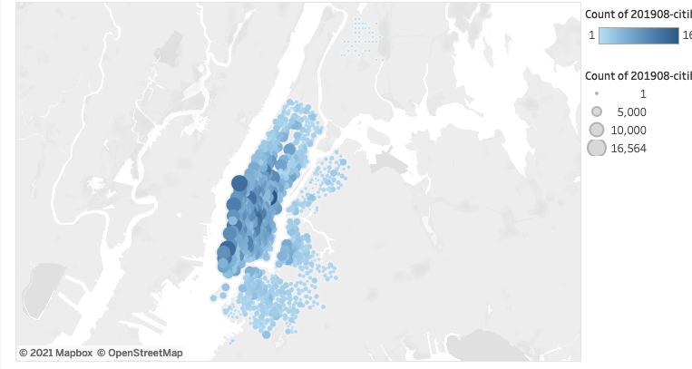
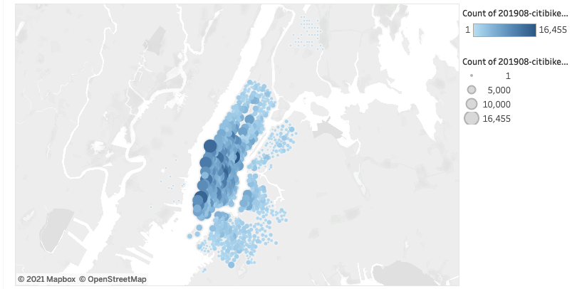

# bikesharing

## Overview of the analysis
We are creating a story to convince investors that a bike-sharing program in Des Moines is a solid business proposal.

## Results: 
[link to dashboard](https://public.tableau.com/profile/melanie.kwak#!/vizhome/citibike_challenge_16196425145110/Story1?publish=yes) 

Checkout times for users

Checkout times by gender

Trips by each weekday per hour

Bike trips by gender (weekday per hour)

Bike trips by gender by weekday

Top starting locations in NYC

Top ending locations in NYC

## Summary: Provide a high-level summary of the results and two additional visualizations that you would perform with the given dataset.

The data shows high activity of the bike sharing service in New York during the month of August 2019.
The far majority of the rides were in the very busy Manhattan Island, taken by male users during morning and evening rush hours. This implies that Citi Bike services are used as an alternative to public transportation by commuting workers.
Additional analysis would be beneficial by :

   comparing data for different months to determine trends across the year
   including weather data to find the correlation between the weather and the rides.
